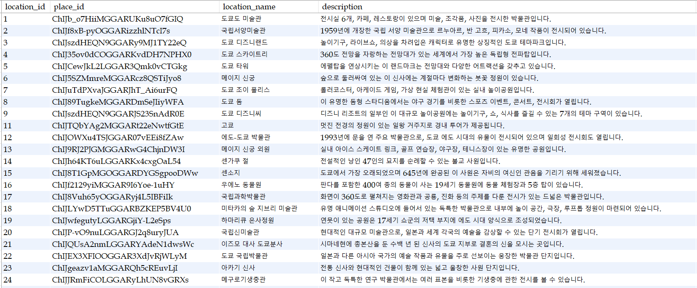

# TripDescriptionCollector


## 프로젝트 개요
**Trip Description Collector**는 MySQL 데이터베이스에서 특정 장소의 정보를 가져와 Google Maps를 통해 상세 설명을 스크래핑한 후, 해당 정보를 다시 데이터베이스에 업데이트하는 자동화 시스템입니다.

## 주요 기능
- MySQL에서 상세 설명이 없는 장소 목록 조회
- Selenium을 활용한 Google Maps 웹 스크래핑
- 스크래핑한 상세 설명을 MySQL 데이터베이스에 저장

## 폴더 구조
```
trip_description_collector/
│── config/
│   ├── __init__.py
│   ├── db_config.py
│
│── database/
│   ├── __init__.py
│   ├── db_connection.py
│   ├── db_operations.py
│
│── utils/
│   ├── __init__.py
│   ├── selenium_scraper.py
│
│── main.py
│── README.md
│── requirements.txt
```

## 설치 방법
### 1. 환경 설정
```sh
python -m venv venv
source venv/bin/activate  # macOS/Linux
venv\Scripts\activate    # Windows
```

### 2. 필수 라이브러리 설치
```sh
pip install -r requirements.txt
```

## 환경 설정
### 1. MySQL 설정 (`config/db_config.py`)
```python
DB_CONFIG = {
    "host": "localhost",
    "user": "root",
    "password": "1234",  # MySQL 비밀번호
    "database": "testdb"   # 데이터베이스 이름
}
```

### 2. MySQL 테이블 생성 (예제)
```sql
CREATE TABLE tbl_location (
    place_id INT PRIMARY KEY AUTO_INCREMENT,
    location_name VARCHAR(255) NOT NULL,
    description TEXT
);
```

## 사용법
### 1. 프로젝트 실행
```sh
python main.py
```

### 2. 실행 과정
1. `get_places_without_description()`: 상세 설명이 없는 장소 목록을 MySQL에서 조회
2. `fetch_description_from_google_maps()`: Google Maps에서 장소 정보를 크롤링
3. `update_place_description()`: 크롤링한 상세 설명을 MySQL에 업데이트

### 3. 주요 코드 설명
- **데이터베이스 연결 (`database/db_connection.py`)**
  ```python
  import mysql.connector
  from config.db_config import DB_CONFIG
  
  def get_connection():
      return mysql.connector.connect(**DB_CONFIG)
  ```
- **Selenium을 이용한 스크래핑 (`utils/selenium_scraper.py`)**
  ```python
  from selenium import webdriver
  from selenium.webdriver.common.by import By
  
  def setup_driver():
      from selenium.webdriver.chrome.service import Service
      from webdriver_manager.chrome import ChromeDriverManager
      service = Service(ChromeDriverManager().install())
      return webdriver.Chrome(service=service)
  ```

## 주의 사항
- `db_config.py`에 MySQL 정보를 올바르게 입력해야 합니다.
- Google Maps 크롤링은 API 정책에 따라 변동될 수 있으므로, 필요 시 API 사용을 고려하세요.

